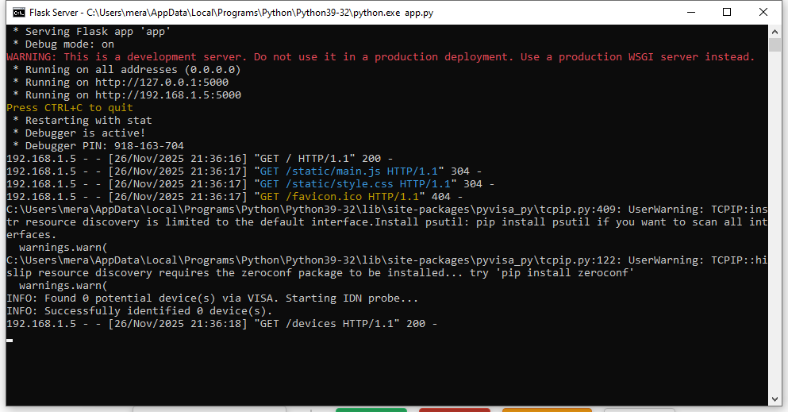
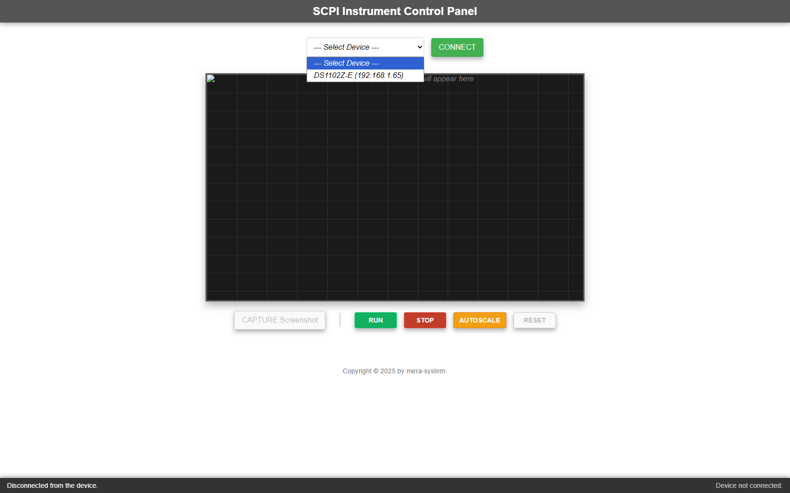
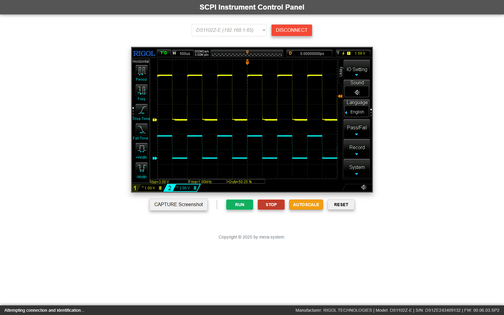
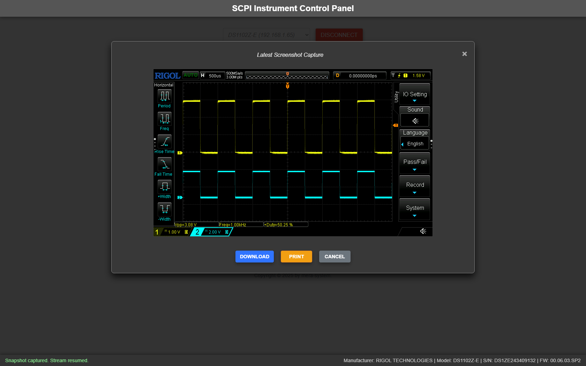
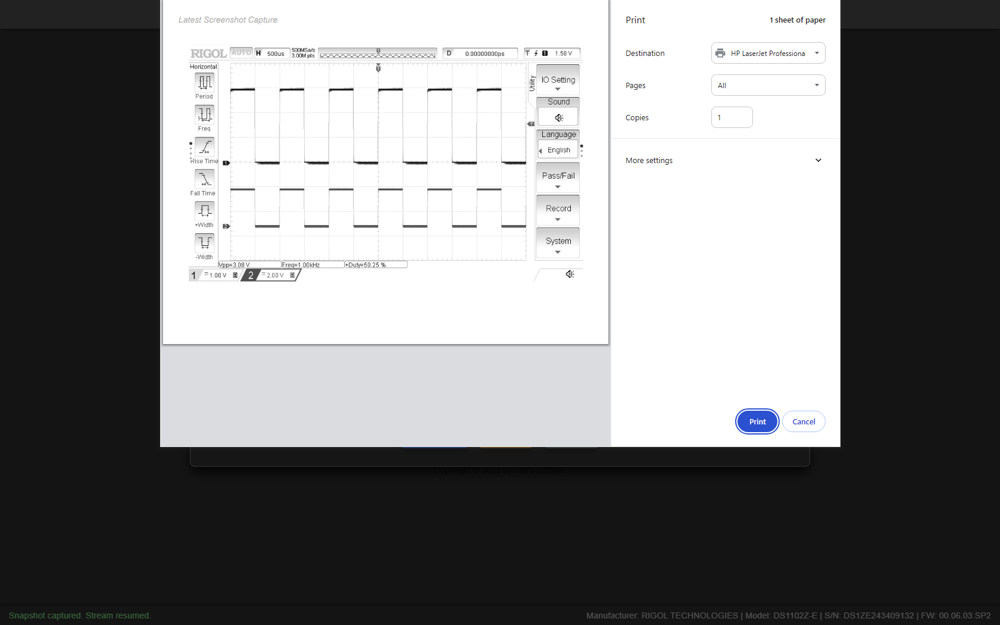

# **SCPI Web Interface**  
*A simple web-based tool for communicating with SCPI instruments over Ethernet*

  
  
  
  
  

---

## 📡 Overview
This project was created out of a very practical need: capturing **screenshots from a Rigol DS1102Z-E oscilloscope** connected to a PC via **Ethernet**.

Rigol’s official Windows software does not support taking screenshots over the network — even though the oscilloscope provides SCPI commands for that purpose. To avoid USB cables, extra drivers, and limitations of vendor software, this lightweight web application was developed to:

- Send SCPI commands over LAN  
- Capture the oscilloscope’s display as an image  
- Show the screenshot directly in a web browser  
- Work with any instrument that supports SCPI (not just Rigol)

The app uses a **Flask backend** and a simple **HTML/CSS/JS frontend**, so it’s extremely easy to understand, modify, and extend.  
Communication with SCPI devices is done through **PyVISA**, which means the tool supports a wide range of instruments from many manufacturers.

In other words — the project started as a tool for my Rigol, but the door is wide open for it to become a universal SCPI web interface.

---

## 🧰 Features
- Capture screenshots from SCPI-compatible instruments  
- Communicate with devices using LAN (VXI-11 / RAW TCP depending on VISA backend)  
- Simple and clean web interface  
- No vendor-specific software required  
- Works with Rigol, Keysight, Siglent, Rohde & Schwarz, and many other SCPI instruments  
- Fully open and easy to modify

---

## 🏗️ Project Structure
SCPI-Web-Interface/
│   app.py
│   run.py
│   requirements.txt
│   .gitignore
│   README.md
│   start.bat
│
├── static/
│   ├── main.js
│   └── style.css
│
└── templates/
    └── index.html

---

## 🔧 Requirements
Before running the application, install the following:

### 1. **Python 3.9+**
Download from:  
https://www.python.org/downloads/

During installation, **check the box**:  
✔ *Add Python to PATH*

### 2. **VISA Backend (Required for communication)**  
You need one VISA backend installed on your system.

You can choose one of the following:

#### **Option A — NI-VISA (Recommended for beginners)**  
https://www.ni.com/en/support/downloads/drivers/download.ni-visa.html

#### **Option B — pyvisa-py (Fully open-source, no NI software needed)**  
Installed automatically with requirements.

If you're not sure — install **NI-VISA**. It works out of the box for Ethernet instruments.

---

## 📦 Installation

### 1. **Download or clone the repository**

git clone https://github.com/YuMERA/SCPI-Web-Interface.git
cd SCPI-Web-Interface

Or simply download the ZIP from GitHub and extract it.

---

### 2. **Install Python dependencies**
Open a terminal inside the project folder and run:

pip install -r requirements.txt

This installs:
- Flask  
- PyVISA  
- pyvisa-py (optional backend)

---

## ▶️ Running the Application

### Option 1 — Start via terminal

python run.py

### Option 2 — Start via batch file (Windows)
Double-click: start.bat

---

## 🌐 Using the Web Interface

1. Start the application and open your browser at: http://localhost:5000
2. The app will automatically **scan all local IP addresses** on your computer and search for devices that respond to **SCPI over Ethernet**.
3. All detected instruments will appear in the **device selection box**.
4. Select the desired device from the list and click **Connect**.
5. Once connected, the application starts a **live stream** of screenshots from the instrument — refreshing every **1000 ms** (1 second).  
   This gives you a near real-time view of the oscilloscope’s display inside your browser.
6. At any moment, you can click **Capture** to take a full-resolution screenshot of the current display.  
   The screenshot can then be:
   - viewed in the browser,
   - **saved** to your computer,
   - or **printed** (optimized for clean black & white printing).
7. You can disconnect at any time and select another device if multiple instruments are available on your network.

---

## ⚙️ Supported Instruments
Any device that supports **SCPI commands** and can communicate over **TCP/IP** should work, including:

- Rigol DS1000Z / DS2000 / MSO series  
- Keysight/Agilent oscilloscopes  
- Siglent SDS series  
- Siglent/Keysight function generators  
- Programmable power supplies  
- Multimeters with LAN support  
- …and many others

---

## 🚀 Future Improvements
- Adding more SCPI commands  
- Live waveform data acquisition  
- Multi-device support  
- Screenshot history / saving  
- Switching between VISA backends from the UI  
- Auto-discovery of devices on the network

---

## 📸 Screenshot Preview

  Start Flask server on port 5000
  
  Select SCPI device
  
  Connect to SCPI device
  
  Capture screenshot from SCPI devices display
  
  Print screenshot B&W
  

---

## 📝 License
MIT License — free to use, modify, or integrate into other tools.

